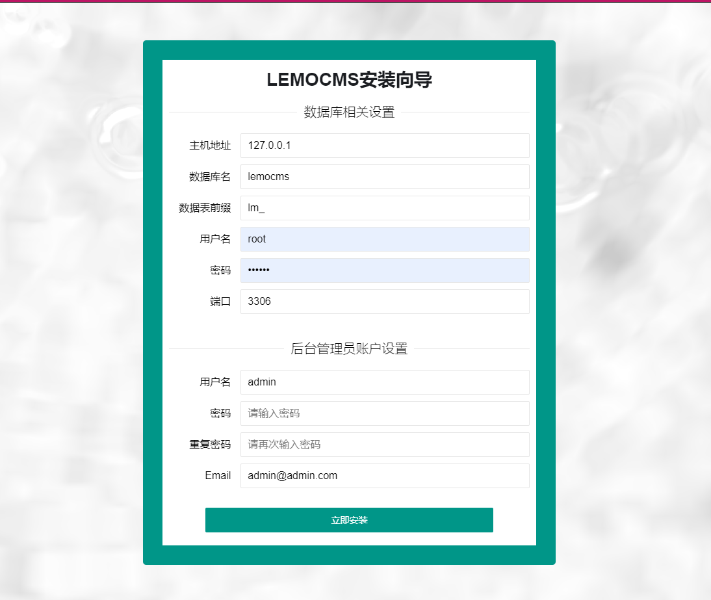

### 导读
###[更新历史](docs/start-log.md) 
###[开发文档](docs/developer.md)
### 如果对你有帮助，请帮忙点个赞 star 一下谢谢
+ Lemocms v1.7.2020.02.27
  
 - cms内容管理插件（模型管理，栏目管理，标签调用等一系列功能,建站好帮手*****推荐） 加qq 或微信 授权获取源码 
 - 社区插件系统完善其他bug 加qq 或微信 授权获取源码 
 - 插件系统修复
 - 后台功能优化
 - 添加附件管理
 - 修复安装程序
 
+ 社区地址 ： https://bbs.lemocms.com/index.php;  加Q获取授权 
+ CMS演示地址 ： https://demo.lemocms.com/cms;  加Q获取授权 

+ QQ群2：[455019756](https://jq.qq.com/?_wv=1027&k=52oRd8O) 

+ 后台演示地址 ： https://demo.lemocms.com/index.php/admin/login/index.html  账号密码 demo 123456 禁止修改数据

### 前言
Lemocms v1.7管理系统：为二次开发而生，让开发变得更简单

 + 这是一款快速、高效、便捷、灵活的应用开发框架。
 + 系统采用最新版TinkPHP6框架开发，底层安全可靠，数据查询更快，运行效率更高，网站速度更快, 后续随官网升级而升级
 + 密码动态加密,相同密码入库具有唯一性，用户信息安全牢固,告别简单md5加密
 + 自适应前端，桌面和移动端访问界面友好简洁，模块清晰。 
 + layui采用最新layui2.5.6 框架
 + easywechat 采用最新的4.*版本
 + 后台权限
 + 站点管理
 + 日志管理
 + 插件管理
 + restful api 接口
 + ...更多

### 系统快照
【系统 - 安装】

【系统 - 首页】

【系统 - 内容管理】

【系统 - 会员管理】

若此项目能得到你的青睐，支持开源项目，可以捐赠支持作者持续开发与维护,这样小哥哥小姐姐更加努力哦。

### 版权信息

lemocms 方便二次开发，您可以方便的使用到自己或企业的项目中,你可以学习或用到项目中，

未授权得情况下,禁止在lemocms整体或任何部分基础上发展任何派生版本、修改版本或第三方版本用于重新分发，经发现必追责。

本项目包含的第三方源码和二进制文件之版权信息另行标注。
版权所有Copyright © 2018-2020 by lemocms [www.lemocms.com](https://www.lemocms.com) All rights reserved。

### 问题反馈
在使用中有任何问题，欢迎反馈给我，可以用以下联系方式跟我交流
QQ群：[455019756](https://jq.qq.com/?_wv=1027&k=52oRd8O)

Github：https://github.com/yue909/lemocms/issues
Gitee : https://gitee.com/limingyue0312/lemocms/issues

