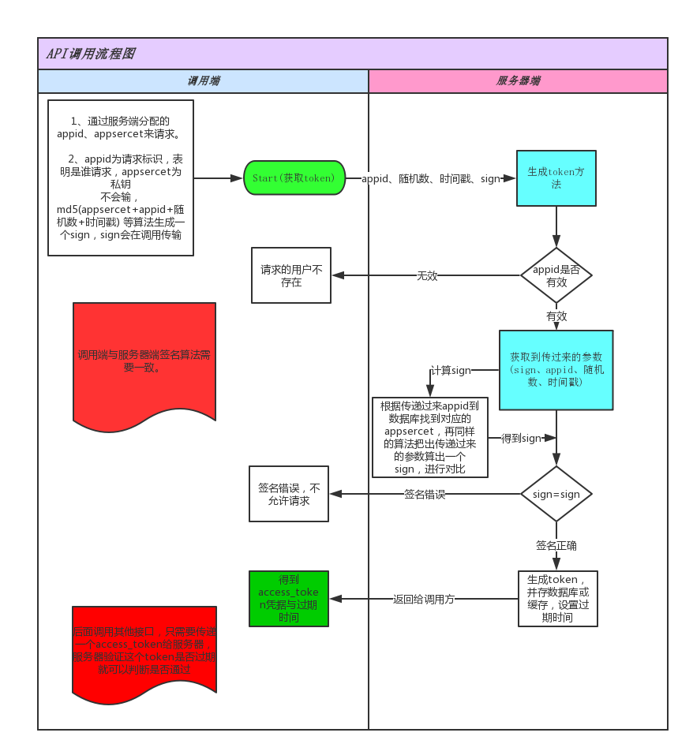
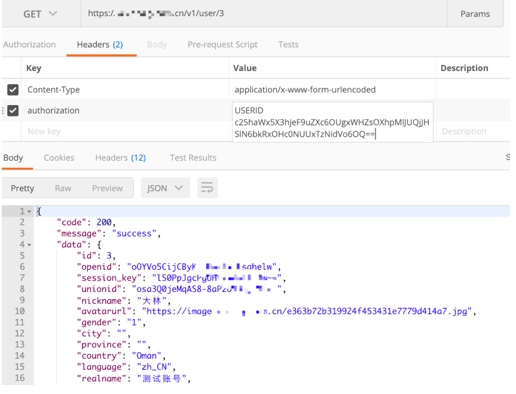

## api开发文档

【api--流程图】
接口代码在extend/lemo/api;

【流程】
app\config\route.php 配置路由
app\route\api.php中定义了路由规则

相关流程

1、获取access_token传参
地址：域名/api/v1/token 
#### 注意这里是多应用要加应用名api
参数：
+ appid 分配的appid
+ nonce 随机数
+ timestamp 时间戳
+ sign 签名

2、 获取access_token、刷新的access_token，过期时间，用户信息
返回参数：
+ access_token
+ expires_time
+ refresh_token   token的过期时间过期了要 （刷新 ）token;
+ refresh_expires_time //刷新token的过期时间 过期了要（重新生成）token;
+ client{appid,uid,mobile,.....}

3、传递access_token进行请求 
加密头规则：USERID base64_encode(appid:token:uid) 
USERID base64_encode('xxxx':'xxxxx':'xxxxx');

 
4 客户端比较 access_token ,expires_time 是否过期 
如果过期了，那么则 请求 v1/token/refresh 参数

5 客户端比较 刷新refresh_token ,refresh_expires_time是否过期，过期了则重新返回第一步的步骤;
重新生成token;

###[例子]访问相应的url，例如：域名/index.php/v1/user

基类控制器lemo/api/Api.php  user 继承 Api;

+ 在Api类中，会有方法init()检测用户是否有权限调用接口

+ init方法会调用Oauth类中的鉴权，$oauth = new Oauth();

+ 根据用户端传递过来的app_key获取缓存中的access_token，在进行对比，如果true，则可以调用user中的各种方法，否则返回不能调用原因

+ Oauth类中的具体请看代码

+ 生成access_token，缓存access_token等相关逻辑在v1/Token.php代码中，使用的是本地缓存，如果需要使用数据库或者redis请查询相关注释说明

+ api端请求需要在header中进行authentication字段拼接，拼接规则：authentication:USERID base64_encode(appid:accesstoken:uid) PS:拼接示例：USERID c25haWx5X3hjeF9uZXc6M0U1TjBtR3dGSTZjZ1BoNEpLdHY4eWQyOVpqTXM3a2Y6Mzgw ，其中USERID后面跟了个空格，空格后面的一串字符串就是appid:accesstoken:uid这几个参数base64_encode后的字符串

+ uid 是请求生成token时候返回的uid，

+ header 传递参数 请看图

+ extend/lemo/Oauth.php中getClient方法，里面有逆向解密authentication值。

快速创建一个restful控制器
cd 到项目根目录

命令行 ：php think make:controller api/v1/Goods

修改路由，注册一个资源路由：在route.php加入下面一行代码： 
Route::resource(':version/goods','api/:version.Goods');
